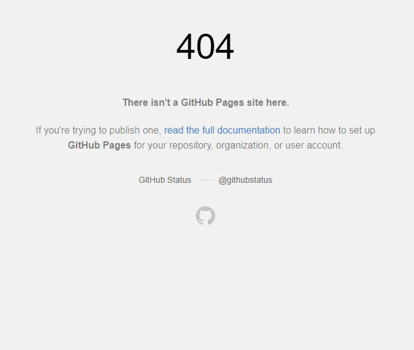

# ABS-Table
我们正在将微信小程序 `ABS分区表` 拓展成网页版，旨在为用户提供更方便、更灵活的使用体验。网页版将保留小程序版的所有功能并将在近期内发布，届时域名预计为：https://abstable.github.io

| 
[网页版](https://ccfddl.top/)   [开发中] 
 | 
[微信小程序](https://github.com/ccfddl/ccf-deadlines/tree/main/cli)   [运行中] 
 |
| :----: | :----: |
|  |  |

## ⭐ 赞助与支持
在过去几个月里，微信小程序 `ABS分区表` 帮助了超过 *6000* 名用户完成ABS期刊的中科院分区等信息的获取。现在，为了让更多人受益，我们正在开发 `ABS分区表` 的网页版本。这是一个庞大的工程，需要投入大量人力和资源。

因此，如果您喜欢并从 `ABS分区表` 中获益，我们非常希望您能为这个项目点赞加星⭐！！！

## 联系方式
如有任何疑问，欢迎通过提交 issue 联系我们。
